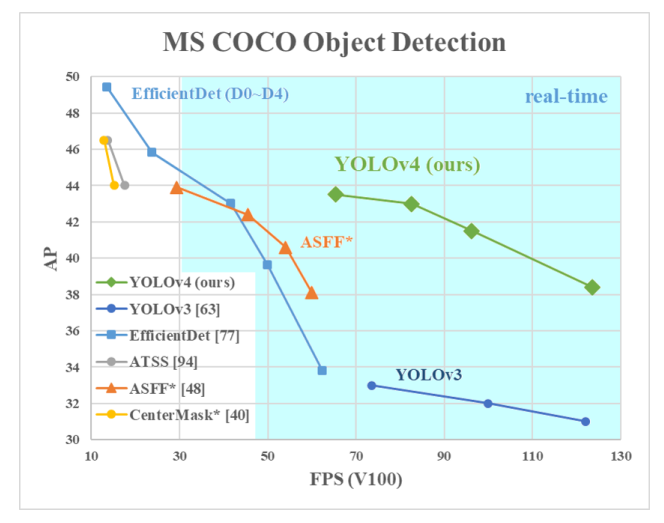
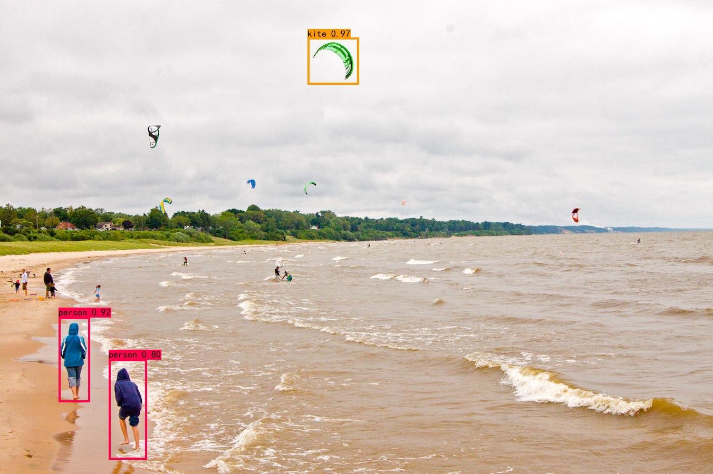
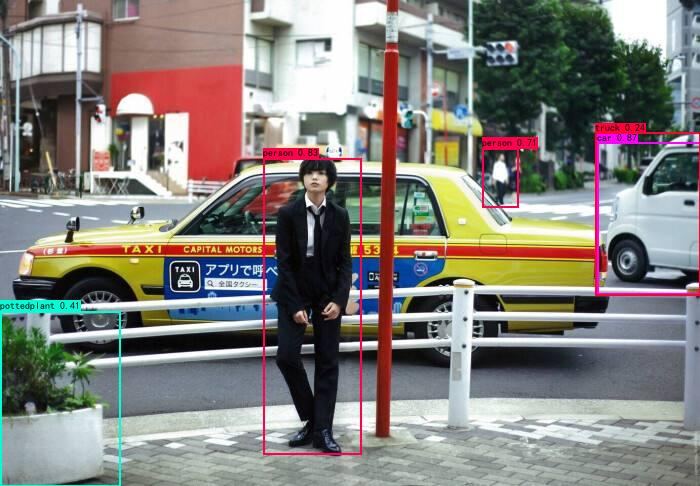

## YOLOv4-Tiny

## implemented by keras and tensoeflow  

### Danger Sources Intelligently Detection System Based on YOLOv4-Tiny


---

### Content
1. [Environment](#environment)
2. [How2train](#training your own dataset)
3. [what is yolov4](#yolov4)
4. [Evalute]()
5. [Do in future]()

### Environment

windows10(you also can run these codes on linux)
tensorflow-gpu==1.13.1  
keras==2.2.4  


### Train Your Own Dataset
1、label you dataset in VOC format and use VOC development toolkit  
2、put your image dataset in yolo4-keras-techi/VOCdevkit/VOC2088/JPEGImages  
3、put your label files in yolo4-keras-techi/VOCdevkit/VOC2088/Annotations   
4、run voc_annotation.py to generate true label files

```python
classes = ["warning sign", "no reflective cloth", "reflective cloth", "staircase", "insulating tool", "tool"]
```
6、modify voc_classes.txt to class names in your project  
7、run train.py  
```
python train.py
```
8、tune parameters in configs.py to make your model be start-of-art

### Evaluation By mAP
1、run get_gt_txt.py to get ground truth of valid dataset 
```
python get_gt_txt.py
```
2、run get_dr_tex.py to get detecting results of valid dataset
```
python get_dr_tex.py
```
3、run get_map.py to get mAP0.5 of your model  
```
python get_map.py
```

### what is YOLOv4?
YOLOv4 is a awesome object detection model that has high accuracy and fast speed.
The paramters of YOLOv4 is almost the same as YOLOv3 but its accuracy is higher than YOLOv3.
Accuracy of YOLOv4(416 resulution) is higher than EfficientDet(D0) and its speed is much faster than EfficientDet(D0).
EfficientDet(D3-D8) have a excellent  accuracy but it can not real time detect even when you use TeslaV100.
<p align="center"></p>

**ASFF** and **ATSS** algorithm also are inferior to YOLOv4.

#### YOLOv4-Tiny has 6 million params, so it is realy fast.

#### YOLOv4-Tiny Result(use coco pretrained model)

<p align="center"></p>
<p align="center"></p>

### TODO
- [x] Transfer Learning
- [x] CSPTiny
- [x] FPN
- [ ] SPP
- [ ] PANet
- [x] Mosaic Aug
- [x] Diou
- [x] Ciou
- [x] Focal loss
- [x] Iou Threshold- using multiple anchors for a single ground truth IoU (truth, anchor) > IoU threshold
- [x] Sigmoid Factor (Eliminate grid sensitivity)
- [x] Tiny Anchors
- [ ] label smooth(i do not recommend to use label smooth in object detection, you can use it in single classifier task)
- [ ] ATSS [Adaptive Training Sample Selection]()
- [x] Mish
- [ ] MixUp
- [ ] Genetic Algorithm
- [ ] WBF(Weighted-Boxes-Fusion)  postprocess <https://arxiv.org/abs/1910.13302>
